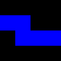
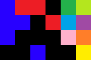
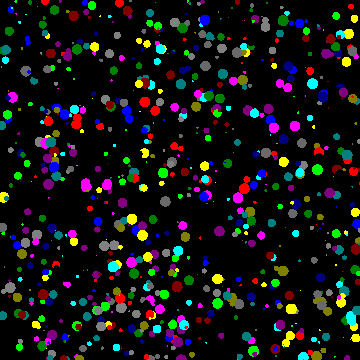

# Contar Cuerpos Celestes

1. Enunciado

  Se suministra a los alumnos un código secuencial (ver apéndices al final de la
  página) para contar el número de objetos diferentes que se ven en una imagen o
  fotografía celeste, en general de espacio profundo, obtenida por un
  radiotelescopio. Ver el siguiente video de ejemplo donde muestra el tipo de
  fotografía obtenida por el radiotelescopio Hubble.

  

  Las imágenes ya han sido procesadas, discretizando la luminosidad observada en
  cada punto en 16 diferentes niveles de grises o colores. Los pixels del fondo
  del espacio, una vez eliminado el ruido, tienen el índice de color 0. Los
  pixels de la imagen con una luminosidad o color suficientemente parecidos se
  representan con un mismo valor entre 1 y 15.

  La imagen se carga en una matriz desde un fichero de texto plano. El fichero
  contiene un número entero en cada línea. Las dos primeras líneas contienen el
  número de filas y columnas de la imagen. El resto son números entre 0 y 15 con
  los valores de cada pixel, ordenados por filas.

  Los pixels del mismo índice de color que están juntos, en horizontal o
  vertical (no en diagonal), se considera que son del mismo objeto. El programa
  etiqueta cada objeto de la imagen con una etiqueta diferente. Todos los pixels
  del mismo objeto tendrán la misma etiqueta. Para determinar el número de
  objetos, al final se cuentan el número de etiquetas diferentes. Los píxeles de
  índice 0 no se etiquetan.

  (Ver ejemplo en transparencias del apéndice más abajo)

2. Detalles del código secuencial

  La fase de etiquetado utiliza 3 matrices del tamaño de la imagen con una fila
  y una columna extra al principio y final de la matriz (halo):
  1. Matriz con los índices de color de cada pixel (en los posiciones del halo
    se coloca el valor 0)
  2. Matriz de etiquetas
  3. Copia de la matriz de etiquetas

  La matriz de etiquetas se inicializa de la siguiente forma:
  - Pixels con índice 0: Se etiquetan con el valor -1
  - Pixels con índices entre 1 y 15: Se etiquetan con la posición del elemento
    de la matriz: _i*NUMCOLS+j_

  La fase de etiquetado es un bucle en el que en cada paso:
  - Se copian los datos de la matriz de etiquetas en la matriz auxiliar de copia
  - Se recorre la matriz de etiquetas (esquivando el halo) actualizando cada
    posición con la etiqueta de menor valor entre la suya propia o una de las de
    sus cuatro vecinos que tenga el mismo índice de color.

  Se repite el proceso hasta que en un iteración ninguna celda de la matriz
  cambia de etiqueta. En ese momento cada masa de pixeles contiguos del mismo
  índice tiene la misma etiqueta, que corresponde con la posición lineal del
  primer pixel del objeto (pixel más arriba y a la izquierda). Finalmente se
  recorre la matriz de etiquetas contando el número de celdas que tienen como
  etiqueta su propia posición lineal. El resultado es el número de objetos
  diferentes.

3. Apéndices

  Puedes ver [aquí](apendiceEnunciado.pdf) las transparencias de presentacion de la práctica con el ejemplo.

  Puedes ver [aquí](../secuencial/) el código secuencial del programa.

  [Ficheros de prueba](../ficherosPrueba):
  - [prueba1.data](../ficherosPrueba/prueba1.data): 4x4 px, 1 objeto

    

  - [prueba2.data](../ficherosPrueba/prueba2.data): 4x4 px, 3 objetos

    

  - [prueba3.data](../ficherosPrueba/prueba3.data): 8x8 px, 8 objetos

    

  - [prueba4.data](../ficherosPrueba/prueba4.data): 4x6 px, 11 objetos

    

  - [circles1.data](../ficherosPrueba/circles1.data): 3200x3200 px

    

(c) 2017, Grupo Trasgo, Universidad de Valladolid
