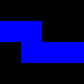
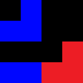
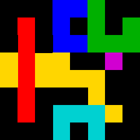
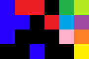
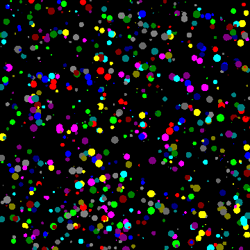

# Ficheros de prueba

- [prueba1.data](prueba1.data): 4x4 px, 1 objeto

  

- [prueba2.data](prueba2.data): 4x4 px, 3 objetos

  

- [prueba3.data](prueba3.data): 8x8 px, 8 objetos

  

- [prueba4.data](prueba4.data): 4x6 px, 11 objetos

  

- [circles1.data](circles1.data): 3200x3200 px

  

(c) 2017, Grupo Trasgo, Universidad de Valladolid
